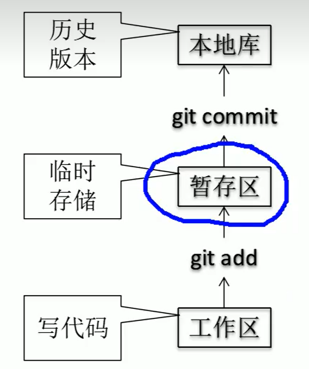
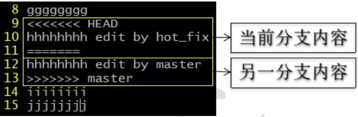
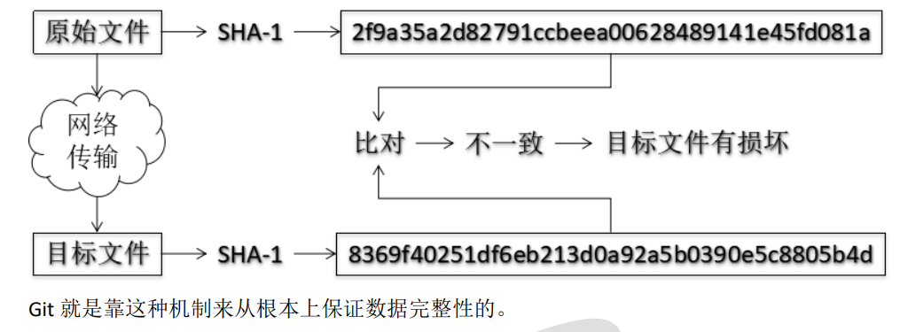
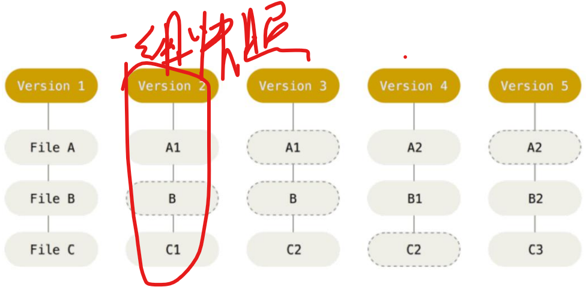
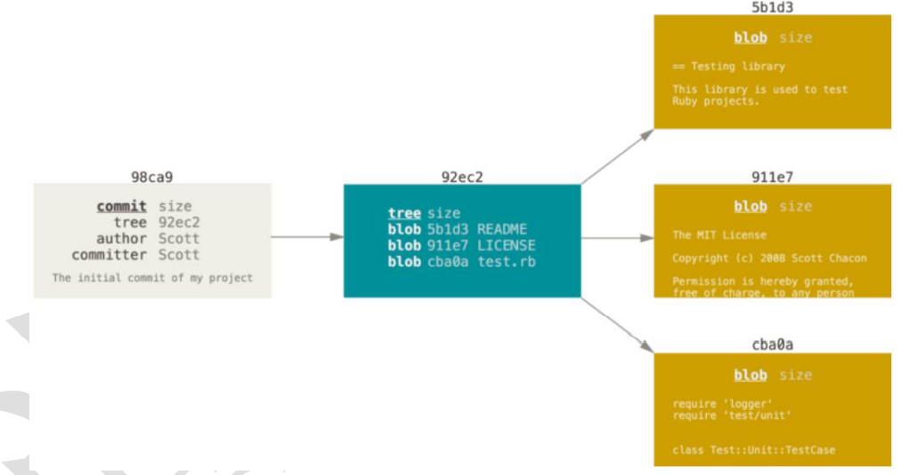
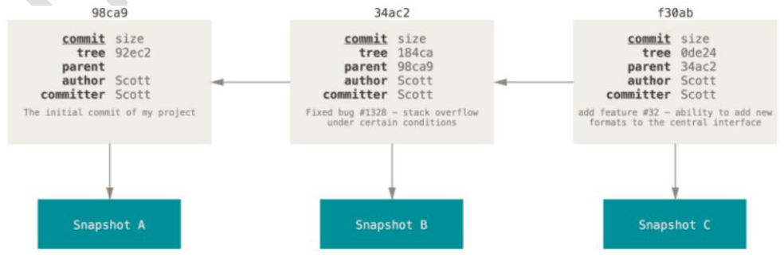
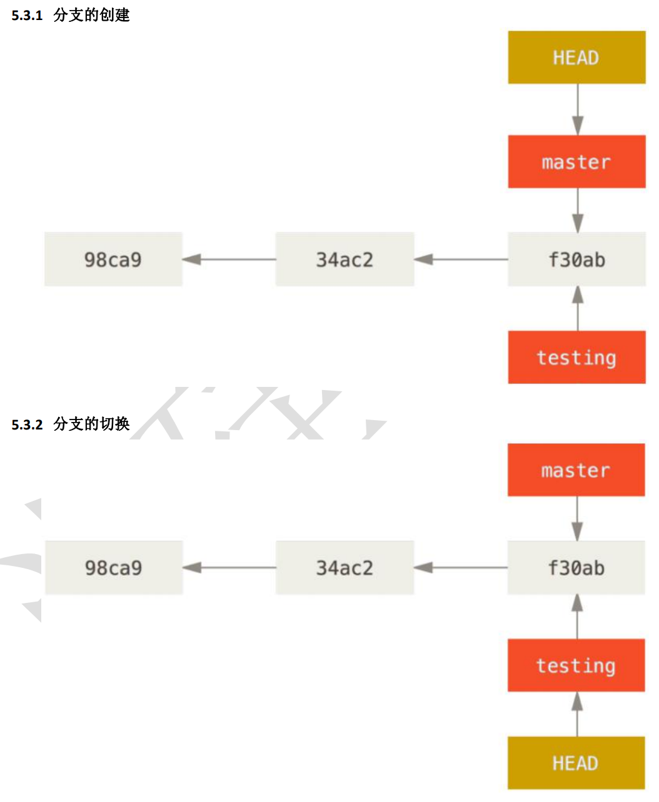
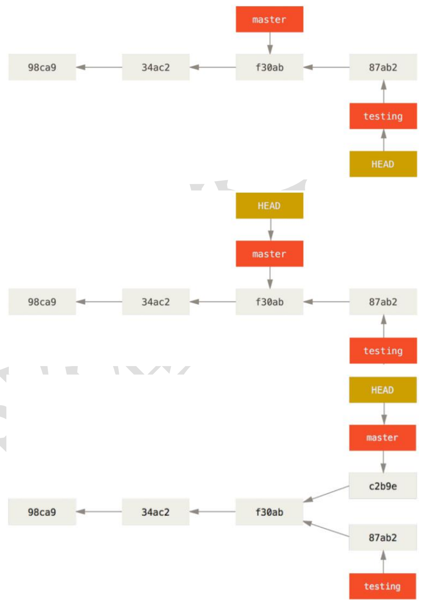

# 理解

## 对Git的理解

1. git关键是对版本的控制
   - 版本的意思就是当时提交时这个文件夹的样子。例如版本1提交时文件夹为temp1.txt，版本2提交时文件夹是temp1.txt、temp2.txt，在版本2回退到版本1后文件夹中就没temp2.txt了。
   - 提交一次就会产生一个版本，版本是所有分支都共享的
2. git中的分支其实就是一个指针，指向一个提交的版本。

# git基础知识

## git和代码托管中心

1. 有本地库和远程库
2. 代码托管中心就是github这种，这是用来管理远程库的

3. 管理本地库和远程库分为团队内部协作和跨团队协作

- 团队内部协作：某人创建一个远程库，各个成员在本地库写完之后上传至远程库

​	

- 跨团队协作：其他团队fork一个远程库，写完之后上传至远程库，但是因为不是一个团队并不能直接合并，需要审核

## git命令行操作

### 本地库初始化

1.  命令：git  init
2. 执行之后会创建一个.git文件夹，但这是隐藏文件
3. .git目录中存放的都是本地库相关的子目录和文件，不要删除，也不能胡乱修改

### 设置签名

1. 作用：区分不同的开发人员的身份
2. 辨析：这里设置的签名和登录远程库（代码托管中心）的账号密码没有什么关系
3. 命令：
   1. 项目级别/仓库级别：仅在当前本地库范围内有效
      1. git config user.name Danny_pro
      2. git config user.email Danny_pro@qq.com
      3. 信息保存位置：.git/config
   2. 系统用户级别：登录当前操作系统的用户范围
      1. git config --global user.name Danny_glo
      2. git config --global user.email Danny_glo@qq.com
      3. 信息保存位置：~/.gitconfig
   3. 级别优先级：两者同时都有时，采用项目级别的签名。不能两者都没有，这是不允许的

### 基本操作

1. 状态查看：git status，查看工作区、暂存区状态
2. 添加操作：git add [filename]，将工作区的“新建/修改”添加到暂存区
3. 提交操作：git commit -m "commit message" [filename],这里直接git commit [filename]会进入vim中，vim中在第一行写语句和前边"commit message"是等价的，前边就是不用进入vim中了更加常用，"commit message"是描述这次提交版本的语句。将暂存区的内容提交到本地库
4. 
5. 查看历史版本
   1. git log，最详细的描述。如果版本很多，一屏显示不完，控制方式为：空格向下翻页，b向上翻页，q退出
   2. git log --pretty=oneline，每一次版本由一行显示，是git log的简略版
   3. git log --oneline，这个在2.基础上，再简化了一点，把哈希值只取一部分显示
   4. git reflog，这个是在3.的基础多了一个HEAD@{移动到此版本需要的步数}
6. 版本前进与后退
   1. 本质，由HEAD指针控制，HEAD指向的就是当前版本
   2. 基于索引值操作（推荐使用）：
      1. git reset --hard [局部索引值]
      2. 不论是前进还是回退都可以，只要输入局部索引值即可
   3. 使用^符号：只能后退
      1. git reset --hard HEAD^
      2. 一个^表示后退一步，n个表示后退n步
      3. 注意：git reflog可以显示所有版本，但是git log --oneline只能显示当前版本之前的版本，^操作和~操作回退的步数都得看git log --oneline显示的版本，由于这个操作并不显示步数，因此^和~操作都不好用
   4. 使用~符号：只能后退，配合^使用
      1. git reset --hard HEAD~n
      2. 表示后退n步
   5. reset命令的三个参数
      1. --soft：仅在本地库移动HEAD指针，此时工作区和暂存区一致，本地库和他俩不一致，查看状态显示绿色modify，表示本地库和暂存区不一致了，需要提交才能一致
      2. --mixed：在本地库和暂存区移动HEAD指针，此时本地库和暂存区一致，和工作区不一致，查看状态显示红色modify，表示暂存区和工作区不一致了，需要添加到暂存区才一致
      3. --hard：在本地库和暂存区和工作区均移动HEAD指针
7. 删除文件并找回
   1. 删除操作
      1. rm aa.txt
      2. git add/rm aa.txt，把删除操作提交到暂存区
      3. git commit -m "delete aa.txt" aa.txt,把删除操作提交到本地库，删除完毕
   2. 找回操作
      1. 前提：删除前，已经把文件存在时的版本提交到本地库了
      2. 操作：git reset --hard [指针位置]
      3. 删除操作已经提交到本地库，指针位置指向文件存在时的版本；删除操作未提交到本地库时，指针也是指向存在时的版本即可
8. 比较文件差异
   1. git diff [文件名]：将工作区和暂存区的文件进行比较
   2. git dif [本地库中的历史版本] [文件名]：将工作区的文件和本地库的历史版本比较
   3. 不带文件名，就是把所有文件进行比较

### 分支管理

1. 分支的好处

   1. 同时并行推进多个功能的开发，提高开发效率
   2. 各个分支在开发工程中，如果某一个分支开发失败，不会对其他分支有任何影响。失败的分支删除重新开始即可。

2. 分支操作

   1. 创建分支：git branch [分支名]

   2. 查看所有分支：git branch -v

   3. 切换分支：git checkout [分支名]

   4. 合并分支

      1. 切换到要合并其他分支的分支上：git checkout [合并其他分支的分支名]
      2. 执行merge命令：git merge [被被合并的分支名]
      3. merge虽然叫合并，但是其实是覆盖，他会用新版本把旧版本覆盖
   
   5. 解决冲突
   
      1. 冲突原因：合并分支和被合并分支都对同一个文件进行了修改，不知道用哪个了
      2. 冲突的表现
   
      
   
      3. 冲突解决
         1. 编辑文件，删除特殊符号（上图显示的<  = > 这些符号）
         2. 把文件修改到满意的程度，保存退出
         3. git add [文件名]
         4. git commit -m "日志"，这一步一定不能加文件名，否则不对

## git原理

### 哈希

**哈希是一个系列的加密算法，各个不同的哈希算法虽然加密强度不同，但是有以下 几个共同点：**

1. 不管输入数据的数据量有多大，输入同一个哈希算法，得到的加密结果长度固定
2. 哈希算法确定，输入数据确定，输出数据能够保证不变 
3. 哈希算法确定，输入数据有变化，输出数据一定有变化，而且通常变化很大 
4. 哈希算法不可逆
5. Git 底层采用的是 SHA-1 算法

### git文件管理机制

1. **Git 把数据看作是小型文件系统的一组快照（snapshot）。每次提交更新时 Git 都会对当前的全部文件制作一个快照并保存这个快照的索引。为了高效，如果文件没有修改， Git 不再重新存储该文件，而是只保留一个链接指向之前存储的文件。所以 Git 的 工作方式可以称之为快照流**

2. **细节**

   1. 提交时，提交的所有文件都会产生一个索引（hash值），组成一个tree值，tree本身也有索引。提交本身也有索引，用于连接父提交对象

      

   2. 每一次提交，都会产生一个新快照，这些快照通过parent相连接，组成一串快照

      

### git分支管理

1. **git分支管理的本质是创建和移动指针**

2. **每一个哈希值代表一个版本，每一个分支都是指向一个版本的指针，HEAD指针指向当前分支的所在版本**

## 连接远程库

### 创建远程库

- 在github中new repository，名字尽量和本地库一致，容易查找
- 不需要自动创建readme，以防本地库本来就有重复了

### 网址登录和ssh免密登录

1. 本地库先把远程库地址保存下来，方便后续使用
   1. git remote add 别名 远程库地址
   2. git remote -v显示所有远程库地址别名信息
2. 两种方式
   1. git remote add 别名 网址，这种方式简单，但是如果没有记录账号密码（win10有一个凭据管理器记录了），则每次推送都需要登录账号密码非常麻烦
   2. git remote add 别名 ssh，这种方式不需要登录
      1. 首先进入家目录cd ~
      2. 删除.ssh目录
      3. 运行命令生成.ssh目录：ssh-keygen -t rsa -C 1062575333@qq.com(git邮箱），注意-C是大写
      4. 进入.ssh目录，复制id_rsa.pub内容
      5. 在github设置中找到SSH and GPG keys,在new ssh key中输入复制的秘钥，起个名字即可
      6. 回到git bash创建远程地址别名就完成了所有步骤

### 推送和克隆

1. 推送
   1. 推送：git push 地址（地址别名） 分支名
2. 克隆
   1. 什么也不用做，就可以在文件夹中直接克隆一个仓库
   2. git clone 远程库地址（别名）
   3. 克隆三个效果
      1. 完整的把远程库下载到本地
      2. 自动创建origin远程地址别名
      3. 初始化本地库（即不需要自己初始化，克隆操作会初始化）

### 邀请别人进入团队

- **在github仓库中的setting里，找到团队协作，然后输入拉取的人的账号，拉取人需要在自己账号中同意一下**

### 拉取

- pull = fetch + merge
- git fetch [远程库别名] [远程库中分支名]，这个操作可以把远程库或某个分支拉取过来，但是并不会覆盖原来的内容，访问拉取过来的内容需要先切换到这个分支git checkout 远程库别名/分支名，再访问其中的内容
- git merge [远程库别名/分支名]，直接合并分支
- 对于简单的可以直接进行pull拉取git pull [远程库别名] [分支名], 比较复杂的可以先去fetch查看一下新的内容，再选择用merge进行合并

### 团队协作的冲突

- 要点
  - 如果不是基于github远程库的最新版所做的修改，不能推送，必须先拉取。
  - 拉取下来如果进入冲突状态（即分支那里会有提示），则按照“分支冲突解决”操作解决即可

### 跨团队协作

- 本团队fork其他团队的仓库，然后就可以自己在自己仓库中修改其中的内容啦
- 改完之后可以提交给原来的团队，使用pull request，点击new pull request，提交时可以添加说明信息，也可以看到新加的内容
- 原来的团队需要审核通过是否合并，也是在pull request中，在里边可以看到更改的内容，审核通过后可以确认合并，同时可以添加日志信息
- 